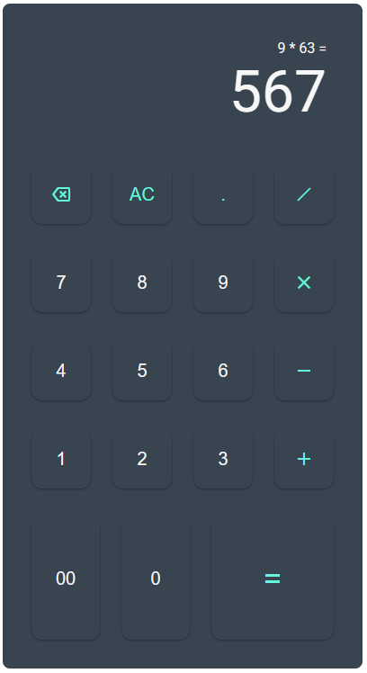

# calculator
Project: Calculator | The Odin Project

The final project of the Foundations Course from The Odin Project.

The goal here is to apply everything from the Foundations Course, including the topics from the "Object Basics" lesson.

The project consists of a simple calculator with the four basic math operations: add, subtract, multiply and divide. It's possible to input numbers with decimal places, undo the last input by clicking the "backspace" button and clear everything through the "AC" button. Last but not least, full keyboard support is also available.

